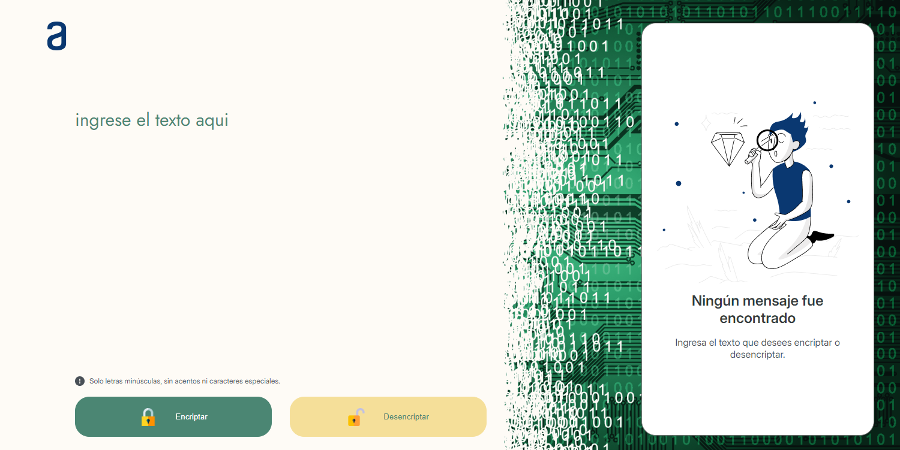
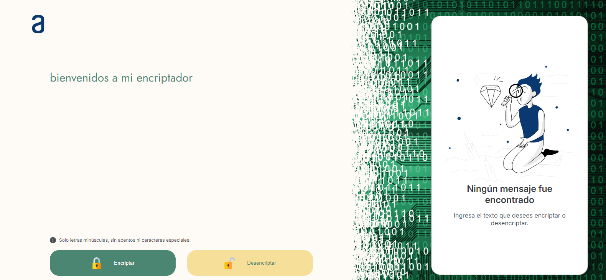
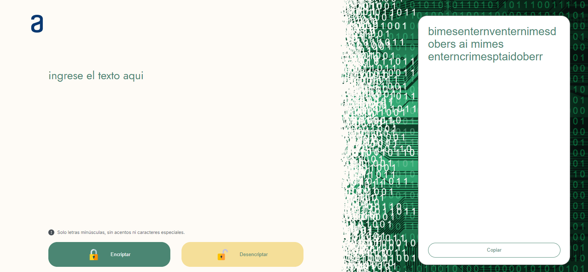
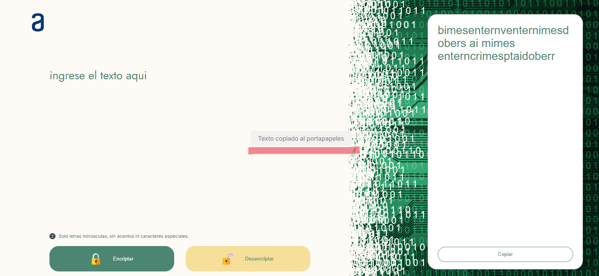
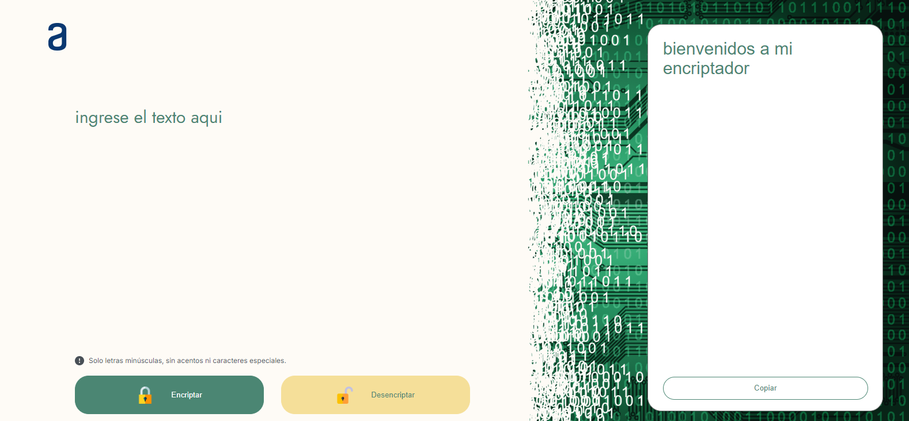

# Encriptador de Texto


## Descripción

Este proyecto es una aplicación web simple que permite a los usuarios encriptar y desencriptar texto utilizando técnicas básicas de cifrado. La aplicación está construida con HTML, CSS y JavaScript puro, lo que la hace ligera y fácil de ejecutar en cualquier navegador moderno.

## :pencil: Características

- **Encriptación de Texto:** Convierte el texto introducido en un formato encriptado utilizando un conjunto específico de reglas.
- **Desencriptación de Texto:** Permite revertir el texto encriptado a su formato original usando las mismas reglas.
- **Interfaz de Usuario Sencilla:** Diseñada con CSS para ofrecer una experiencia de usuario clara y accesible.
- **Compatibilidad con Navegadores:** Funciona en todos los navegadores modernos.

## :lock: :unlock: Llaves de Encriptación

Las "llaves" de encriptación que utilizaremos son las siguientes:

- La letra **"e"** es convertida para **"enter"**.
- La letra **"i"** es convertida para **"imes"**.
- La letra **"a"** es convertida para **"ai"**.
- La letra **"o"** es convertida para **"ober"**.
- La letra **"u"** es convertida para **"ufat"**.

## Requisitos

- Debe funcionar solo con letras minúsculas.
- No deben ser utilizadas letras con acentos ni caracteres especiales.
- Debe ser posible convertir una palabra a su versión encriptada y también devolver una palabra encriptada a su versión original.

### Ejemplos de Uso:

- `"gato"` => `"gaitober"`
- `"gaitober"` => `"gato"`

## Funcionalidades de la Página

La página consta de una **Entrada de Texto:** para la inserción del texto que será encriptado o desencriptado.

- **Opciones de Encriptación/Desencriptación:** El usuario debe poder escoger entre las dos opciones.
- **Visualización del Resultado:** El resultado debe ser mostrado en la pantalla.
- **Copiar al Portapapeles:** Un botón que copie el texto encriptado/desencriptado al portapapeles, con la misma funcionalidad que la combinación de teclas **Ctrl+C** o la opción "copiar" del menú de las aplicaciones.



## :computer: Ejemplo de uso 
   Encriptaremos el siguiente mensaje: "bienvenidos a mi encriptador".
   > [!NOTE]
   > Si el usuario llega a ingresar una letra con acento, un carácter especial o una letra mayúscula, el programa por si solo intercambia las letras con acento a su versión sin acento, las mayúsculas y carácteres no deja ni siquiera ingresarlos.
   
   
   especiales ni si quiera se pueden escribrir.

   Al dar clic en el boton "Encriptar" podemos ver que nos aparece el mensaje desencriptado a la derecha y del mismo modo abajo del mensaje encriptado aparece un botón de copiar.
   

   Si damos clic al botón de copiar, en medio de la pantalla aparecerá un cartel por aproximadamente 2 segundos con la leyenda: "Texto copiado al portapapeles" dado lo anterior sabremos que nuestro texto ya está en el portapapeles listo para pegarlo.
   

   Por ultimo desencriptemos el mensaje.
      
      
   
## :hammer_and_wrench: Instalación

No es necesaria la instalación. Simplemente descarga el proyecto y abre el archivo `index.html` en tu navegador.

> [!NOTE]
> Tambien puedes ir al enlace de GitHub Pages donde podrás utilizarlo [Encriptador Alfredo Rosales](https://alfredorosales12.github.io/ChallengeEncriptador/).

## Uso

1. Clona este repositorio o descarga los archivos.

   ```bash
   git clone https://github.com/AlfredoRosales12/ChallengeEncriptador


## Contribuciones:

Las observaciones, contribuciones,etc.  son bienvenidas. Si encuentras algún error o tienes alguna sugerencia, por favor, abre un issue en este repositorio.

## :copyright: Licencia:

Este proyecto está bajo la licencia OpenSource, Creado por Alfredo Rosales [@AlfredoRosales12](https://github.com/AlfredoRosales12)

¡Diviértete encriptando!

## :iphone: Contact

Te puedes comunicar conmigo a través de los siguientes canales de comunicación:

- [Discord](https://discord.com):
  - `@Alfredo Rosales` Nombre de Usuario
- [LinkedIn][@Alfredo Rosales](https://www.linkedin.com/in/alfredo-rosales-aguilar-5048b0264/)
- [GitHub][@AlfredoRosales12](https://github.com/AlfredoRosales12)
- [Correo Electronico][rosales.alfredo.goo@gmail.com]
